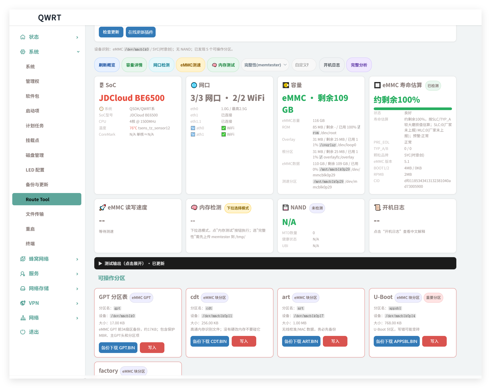

# luci-app-route-tool

OpenWrt LuCI 插件：路由器存储健康诊断 + 分区管理 + 网口检测 + 内存压力测试



## 功能

- **SoC 信息**：CPU 型号、核心数、温度、CoreMark
- **网口检测**：物理网口状态/速率、WiFi 频段/信道
- **eMMC 健康检测**：寿命预估、PRE_EOL、制造商识别（38家）
- **eMMC 读写速度**：实际读写测速 + 颗粒/BOOT/RPMB/CID/版本诊断
- **eMMC 分区管理**：GPT/cdt/art/appsbl/bl2/fip/factory 备份与写入
- **内存压力检测**：轻量/标准/写满三档，验证内存可靠性
- **NAND 检测**：MTD 分区、坏块、ECC 状态
- **开机日志分析**：异常/警告/提示三级分类
- **固件更新**：sysupgrade 在线刷机

## 一键安装

```bash
wget -O /tmp/luci-app-route-tool.ipk https://github.com/rothdren-lion/luci-app-route-tool/releases/latest/download/luci-app-route-tool_all.ipk
opkg install /tmp/luci-app-route-tool.ipk
```

或从 [Releases](../../releases) 下载版本化 IPK 手动安装：

```bash
opkg install luci-app-route-tool_0.3.15-1_all.ipk
```

### 在线 OTA

v0.3.13 起，页面标题版本号旁会每天自动检查一次 GitHub Releases；发现新版本时显示 `可更新` 小标识，点击即可在线 OTA 更新插件。

## 使用

安装后在 LuCI 后台进入 **系统 → Route Tool** 即可使用。

### 内存压力检测说明

- **轻量**：约 25% 可用内存，保留 /tmp 余量
- **标准**：约 60% 可用内存
- **写满**：填满 /tmp 直到 ENOSPC（"No space left" = PASS）

⚠ 内存压力检测结果仅供参考，不代表真实内存带宽。

### eMMC 制造商识别

内置 38 家 eMMC 制造商 ID 映射（mmc-utils 官方仅 13 家），部分由 T76 编程器拆机确认：

- `0xd6/0x88` → Longsys(江波龙) — T76 编程器确认
- `0xf4` → BIWIN(佰维) — T76 编程器确认
- `0xea` → SPeMMC/深圳 — 实测
- `0x0a` → GigaDevice(兆易创新) — 文档
- `0x01` → Samsung(三星) — mmc-utils
- 共 38 家，覆盖主流国际 + 国产品牌

### 分区操作危险提示

写入分区操作很危险，请确定知道自己在玩什么！对应位置写错文件必砖！

## 支持设备

- 高通 IPQ6018/IPQ807x 系列（eMMC + GPT 分区）
- 联发科 MT7981/MT7986 系列（eMMC 或 NAND）
- 联发科 MT7621 系列（NAND/NOR）
- 其他 OpenWrt 设备（部分功能可用）

## 文件结构

```
files/usr/lib/lua/luci/controller/route_tool.lua   — LuCI 控制器
files/usr/lib/lua/luci/view/route_tool/index.htm   — 前端页面
files/usr/libexec/route-tool                         — 主后端：分区检测/备份/写入
files/usr/libexec/route-tool.d/
  storage_common.sh    — 共享函数库（ext_csd/制造商映射/缓存）
  storage_system.sh    — SoC/网口/CoreMark/WiFi
  storage_speed.sh     — eMMC 顺序读写测速
  storage_memory.sh    — 内存压力测试
  storage_capacity.sh  — 容量详情
  storage_health.sh    — eMMC 健康度（ext_csd）
  storage_detail.sh    — eMMC CID/详情
  storage_nand.sh      — NAND 信息
  storage_bootlog.sh   — 启动日志分析
  storage_smart.sh     — 综合诊断入口
  storage_analyze.sh   — eMMC 完整分析报告
```

## 版本历史

### v0.3.10
- 🏷️ eMMC 版本增强：byte192 报 5.01 但 CMDQ>0 时提示可能为 5.1
- 🎨 容量卡：无 NAND 时隐藏 NAND 总量行
- 🏷️ 制造商映射：0xea=SPeMMC/深圳

### v0.3.9
- 🧩 MTK eMMC 分区补全：bl2/fip 纳入可操作分区
- 🏷️ eMMC 制造商库扩充至 38 家（含 BIWIN 佰维 0xf4）
- 🚀 测速同时显示诊断信息：颗粒品牌、BOOT1/BOOT2、RPMB、eMMC 版本、CID

### v0.3.8
- 🧠 内存测速 → 内存压力检测：轻量/标准/写满三档
- 🛡️ 卸载不炸 LuCI：新增 prerm/postrm 脚本
- 📦 安装→卸载→重装循环验证通过

### v0.3.7
- 🔧 代码质量修复：统一 ext_csd 偏移量、修复 PRE_EOL bug
- 🔧 统一制造商 ID 映射为单一来源

### v0.3.6
- 🎉 初始公开版本

## 技术栈

- 后端：POSIX sh 脚本（BusyBox 兼容）
- 前端：LuCI + 原生 JS
- 架构：`all`（纯脚本，无编译依赖）

## License

MIT © 数码罗记 · godsun.pro
