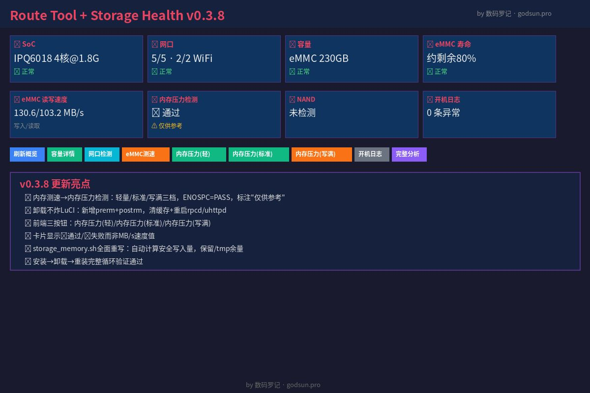

# luci-app-route-tool

OpenWrt LuCI 插件：路由器存储健康诊断 + 网口检测 + 内存压力测试 + 开机日志分析



## 功能

- **SoC 信息**：CPU 型号、核心数、频率
- **网口检测**：物理网口状态、WiFi 频段/信道
- **eMMC 健康检测**：寿命预估、健康状态、制造商识别
- **eMMC 读写速度**：实际读写测速
- **内存压力检测**：轻量/标准/写满三档，验证内存颗粒可靠性
- **NAND 检测**：MTD 分区、坏块、ECC 状态
- **开机日志分析**：异常/警告/提示三级分类
- **综合分析**：一键全量诊断

## 安装

```bash
# 下载 IPK
opkg install luci-app-route-tool_0.3.9_all.ipk
```

或从源码编译：

```bash
# 将文件复制到 OpenWrt SDK/源码目录
make package/luci-app-route-tool/compile
```

## 使用

安装后在 LuCI 后台进入 **系统 → Route Tool** 即可使用。

### 内存压力检测说明

- **轻量**：约 25% 可用内存，保留 /tmp 余量
- **标准**：约 60% 可用内存
- **写满**：填满 /tmp 直到 ENOSPC（"No space left" = PASS）

⚠ 内存压力检测结果仅供参考，不代表真实内存带宽。

## 支持设备

- 高通 IPQ6018/IPQ807x 系列（eMMC）
- 联发科 MT7981/MT7621 系列（NAND）
- 其他 OpenWrt 设备（部分功能可用）

## 版本历史

### v0.3.8
- 🧠 内存测速 → 内存压力检测：轻量/标准/写满三档
- 🛡️ 卸载不炸 LuCI：新增 prerm/postrm 脚本
- 📊 前端三按钮 + "仅供参考" 标注
- 📦 安装→卸载→重装循环验证通过

### v0.3.7
- 代码质量修复：统一 ext_csd 偏移量、修复 PRE_EOL bug
- 统一制造商 ID 映射（0x88 = Longsys/江波龙）

### v0.3.6
- 初始公开版本

## 技术栈

- 后端：POSIX sh 脚本（BusyBox 兼容）
- 前端：LuCI + 原生 JS
- 架构：`all`（纯脚本，无编译依赖）

## License

MIT
